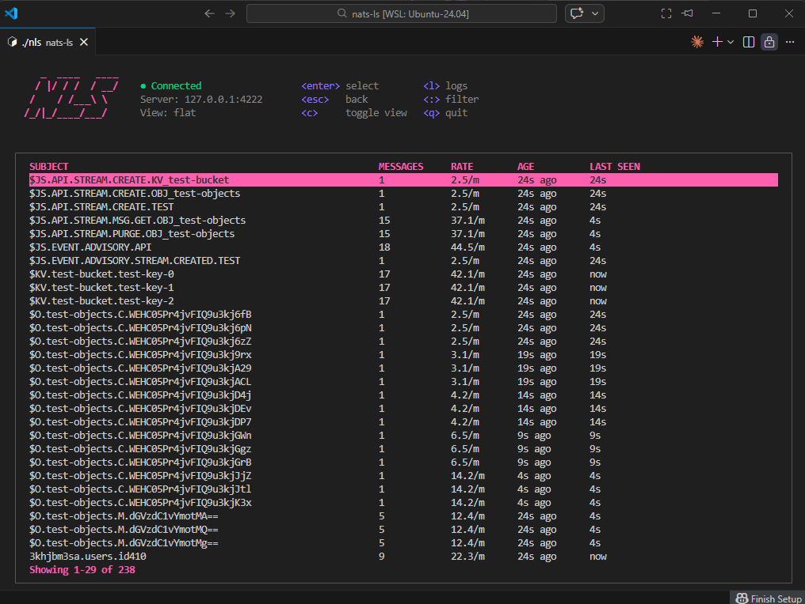
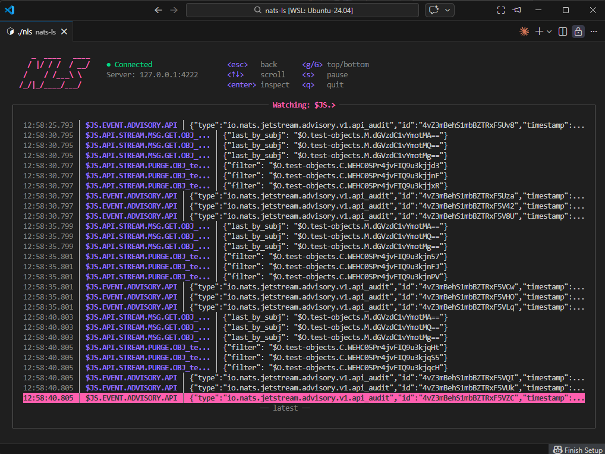
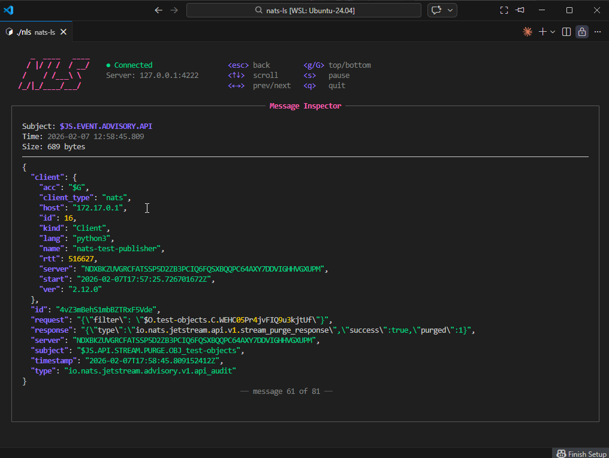
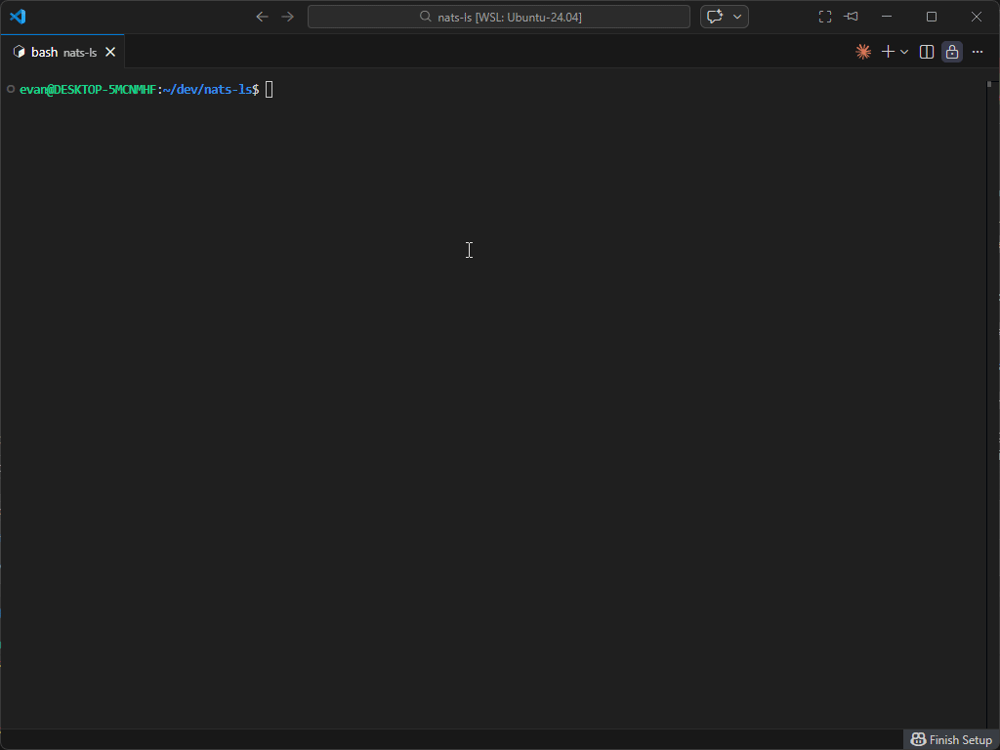
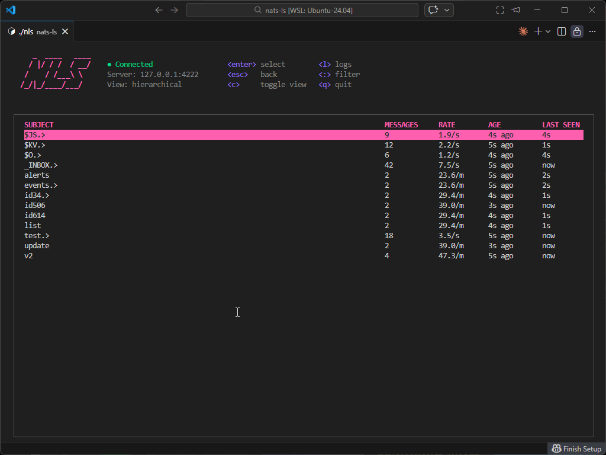
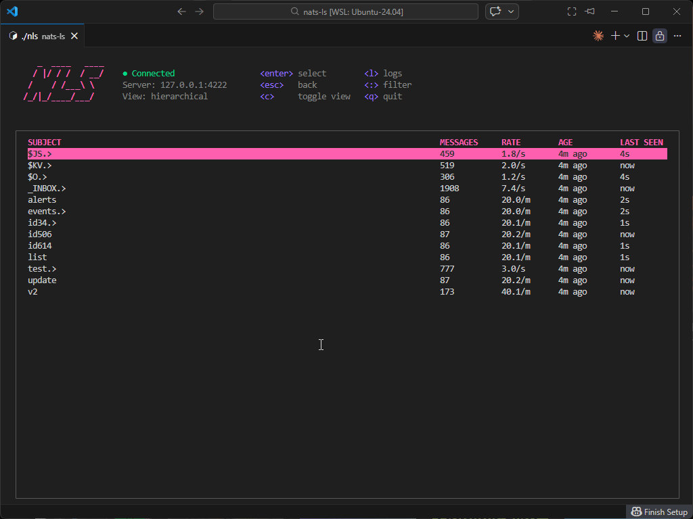
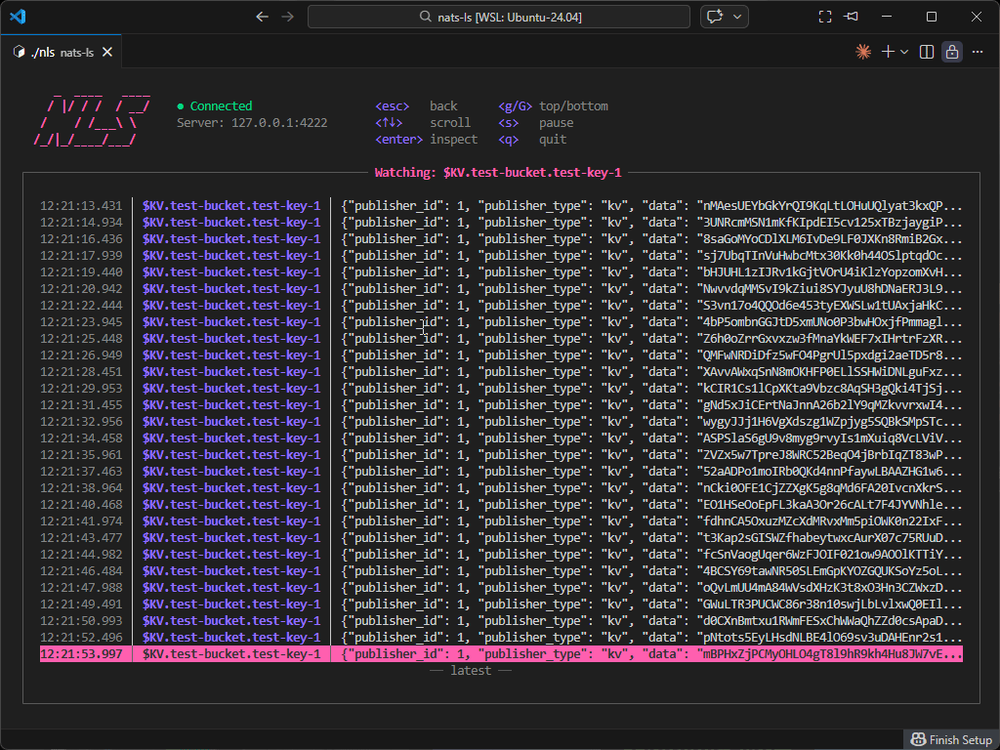

<div align="center">
    
    <br/>
    <em>Terminal UI for NATS message inspection</em>
</div>

[](https://github.com/eallender/nats-ls/actions/workflows/ci.yml)
[](https://goreportcard.com/report/github.com/eallender/nats-ls)
[](https://golangci.com/r/github.com/eallender/nats-ls)
[](https://github.com/eallender/nats-ls/blob/main/LICENSE)

---

**nats-ls** (or **nls**) is a lightweight terminal UI inspection tool that enables developers to quickly see what is happening within an active NATS server. Monitor subjects in real-time, inspect message flow, and debug your NATS-based applications with an intuitive interface.

## Table of Contents

- [Features](#features)
- [Installation](#installation)
- [Quick Start](#quick-start)
- [Configuration](#configuration)
- [Screenshots](#screenshots)
- [Building from Source](#building-from-source)
- [Contributing](#contributing)
- [License](#license)

## Features

- **Real-time subject monitoring** - Watch all active subjects on your NATS server
- **Hierarchical subject display** - View subjects in a tree structure or flat list
- **Message inspection** - Dive deep into individual messages with full payload viewing
- **Subject filtering** - Quickly filter subjects to find what you're looking for
- **Subject condensing** - Collapse hierarchical subjects for better overview
- **Multiple view modes** - Switch between browse, inspect, and log views
- **Configurable connection** - Connect to any NATS server with flexible configuration
- **Lightweight and fast** - Built with Go and Bubble Tea for optimal performance

## Installation

### Using Go

```bash
go install github.com/eallender/nats-ls/cmd/nls@latest
```

The binary will be installed as `nls` in your `$GOPATH/bin` directory.

### Download Binary

Download the latest release for your platform from the [releases page](https://github.com/eallender/nats-ls/releases).

## Quick Start

### Basic Usage

```bash
# Connect to local NATS server
nls

# Connect to specific server
nls --server 127.0.0.1:4222

# Specify URL and port separately
nls --url 127.0.0.1 --port 4222

# Show version
nls --version

# Generate default config file
nls --generate-config
```

### Navigation

- **Browse mode**: View and select subjects
- **Inspect mode**: Examine individual messages in detail
- **Log mode**: View application logs

## Configuration

Configuration is stored in `~/.nats-ls/config.yaml`. Generate a default configuration file:

```bash
nls --generate-config
```

## Screenshots

### TUI Screenshots

1. **Subjects View**


2. **Subject Messages**


3. **Message Inspection**


### TUI Recordings

1. **Subject Listing and Condensing**


2. **Hierarchical Subject Display**


3. **Subject Filtering**


4. **Message Inspection**


## Building from Source

### Prerequisites

- Go 1.24.5 or later
- A NATS server for testing

### Build

```bash
# Clone the repository
git clone https://github.com/eallender/nats-ls.git
cd nats-ls

# Build
go build -o nls ./cmd/nls

# Run
./nls
```

## Contributing

Contributions are welcome! Please feel free to submit a Pull Request. For major changes, please open an issue first to discuss what you would like to change.

## License

This project is licensed under the Apache License 2.0 - see the [LICENSE](LICENSE) file for details.

## Acknowledgments

- Built with [Bubble Tea](https://github.com/charmbracelet/bubbletea) - A powerful TUI framework for Go
- Uses [NATS](https://nats.io/) - High-performance messaging system